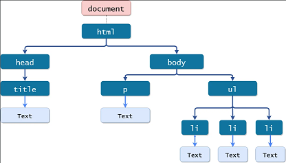

# Learning Some Svelte Basics

## Some Notes on Svelte

### Svelte is a web framework that allows developers to build web applications by writing components

Some defining components of Svelte:

- Reactivity: Svelte components automatically update and re-render when underlying data changes
- Component-base Architecture: Svelte resolves around the idea of building applications as a composition of 
reusable components
- Declarative Syntax: Svelte uses an expressive syntax that resembles HTML, CSS, and JavaScript
- No Virtual DOM: Svelte does not rely on a virtual DOM for updating the interface. It instead shifts
much of its work to the build process rather than the browser's runtime

  - A DOM is an interface that allows developers to interact with the content/structure of the HTML.
It represents the web page as a tree-like structure, where each element is a node in the tree.

  - A Virtual DOM is a lightweight copy of the actual DOM. Changes made to the framework are first applied
to the virtual DOM. Then, it is compared to the previous state to determine the minimal set of changes needed
to update the actual DOM. Then these changes are all applied in one batch to the actual DOM.
  - Svelte, on the other hand, keeps track of code that relies on reactive data and creates reactive bindings 
between the component's data and the DOM elements that use it. It performs this change detection at compile time
rather than runtime.
  - This leads to smaller bundle size, higher optimization, faster runtime performance, and no special state
management (less complexity).
- Animation / Transition Support: Svelte offers built-in support for animations and transitions to make things look nicer

Components are written in .svelte files that contain HTML, CSS, and JavaScript

## Creating a Simple Svelte Project

First make sure that you have Node.js and npm installed. You can check by running `node -v` and `npm -v`. 

Next run the following command in your terminal `npm install -g degit`. You will only ever have to do this once. This
command globally installs a utility called `degit` that allows you to clone repositories without the version history. 
It is commonly used to quickly scaffold or initialize new projects from templates. So once you've run this command once,
you should be able to use `degit` from any directory in your terminal.

Then, run this command `npx degit sveltejs/template new-svelte-app`. This will create a new folder named `new-svelte-app` that 
that will contain the basic structure of Svelte project. You can refer to the `basic-svelte-app` directory to see if they
look the same.

You can then navigate into the directory by running `cd new-svelte-app`, install the dependencies by running `npm install`, 
and then start you Svelte app by running `npm run dev` or navigating to the `package.json` and clicking the button next 
to dev. After that you can start adding your own components and exploring what can be done.